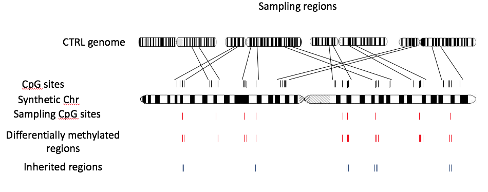

```{r style, echo = FALSE, results = 'asis'}
BiocStyle::markdown()
library(knitr)
```

<br />
**Package**: `r Rpackage("methylInheritanceSim")`<br />
**Authors**: `r packageDescription("methylInheritanceSim")[["Author"]]`<br />
**Version**: `r packageDescription("methylInheritanceSim")$Version`<br />
**Compiled date**: `r Sys.Date()`<br />
**License**: `r packageDescription("methylInheritanceSim")[["License"]]`<br />


# Licensing 

The **methylInheritanceSim** package and the underlying 
**methylInheritanceSim** code 
are distributed under the Artistic license 2.0. You are free to use and 
redistribute this software. 


# Introduction

DNA methylation plays an important role in the biology of tissue development 
and diseases. High-throughput sequencing techniques enable genome-wide 
detection of differentially methylated elements (DME), commonly sites (DMS) or 
regions (DMR). The analysis of treatment effects on DNA methylation, from 
one generation to the next (inter-generational) and across generations that 
were not exposed to the initial environment (trans-generational) represent 
complex designs. There are two main approaches to study the methylation 
inheritance, the first 
is based on segregation in pedigree while the second uses the intersection 
between the DME of each generation (useful when pedigree is unknown). The 
power and the false positve rate of those types of design are relatively 
hard to evaluate.

We present a package that simulates the methylation inheritance. Using real 
datasets, the package generates a synthetic chromosome by sampling regions. 
Two different distributions are used to simulate the methylation level at 
each CpG site: one for the DMS and one for all the other sites. The second 
distribution takes advantage of parameters estimated using the control 
datasets. The package also
offers the option to select the proportion of sites randomly fixed as DMS, 
as well as, the fraction of the cases that inherited the DMS in the 
subsequent generations. 

The **methylInheritanceSim** package generates simulated multigenerational 
DMS datasets that are
useful to evaluate the power and the false discovery rate 
of experiment design analyse, such as the
`r Rpackage("methylInheritance")` package does.


# Loading methylInheritanceSim package

As with any R package, the `r Rpackage("methylInheritanceSim")` package should 
first be loaded with the following command:

```{r loadingPackage, warning=FALSE, message=FALSE}
library(methylInheritanceSim)
```


# Description of the simulation process

The synthetic methylated sites (or CpG sites) are generate using a real 
dataset (methData parameter). Two parameters
determine this step (nbBlock and lBLock). The nbBlock representes the number 
block randomly selected in the real dataset genome. Each block must contain 
lBlock consecutive methylated sites.



For each methylated site of the synthetic chromosome, we estimate the 
parameters alpha and beta of a distribution beta from the mean and variance of
the proportion of C/T  for the CTRL at this site. We use this Beta distribution 
to simulate the the proportion of C/T in the controle dataset.

We select randomly the DMS from methylated sites from synthetic chromosome 
(mean of the proportion of DMS on the number of methylated sites is rateDiff). To 
create DMR, the successors of the selected DMS are more likely to be DMS too, 
if they are nearer than 1000 base pairs. After a proportion (propInherite) of 
the DMR are selected has inherited 

For the case simulation of the F1 generation, for methilated sites not selected 
as DMS, the same beta distribution as the control is used to simulate the 
proportion of C/T. For the DMS, a proportion (vpDiff) of the cases are selected 
and the C/T follow a shift Beta 
distribution (the parameter are estimated with mean of control + or - vDiff). 
The 1 - vpDiff other case follow the same distribution as a control. 
The parameter vpDiff is liked penetrance. 

For the subsequent generation, for the selected DMS inherited, a proportion of 
the case (vpDiff x power(vInheritance, number of generation after F2) ). The 
proportion of C/T of the selected cases follow a shifted Beta distribution 
(the parameter are estimated with mean of control + or - (vDiff * propHetero) ).
The propHetero is 0.5 if one of the parent are control.


# Case study 

## The dataset

A dataset containing methylation data (6 cases and 6 controls) has been 
generated using the `r Rpackage("methylInheritanceSim")` package and a real 
dataset from Rat experiment (the real dataset is not public yet so we used a 
simulation based on it). the data have been formated with 
the `r Rpackage("methylkit")` package in methylBase oject (with the methylKit
functions: filterByCoverage, normalizeCoverage and unite)


```{r caseStudy01, warning=FALSE, message=FALSE, collapse=TRUE}
## Load  read DMS dataset (not in this case but normaly)
data(samplesForChrSynthetic)
    
```


## The simulation

The simulation can be run using the *runSim* function.
The **outputDir** parameter fix the directory where the results are stored.


```{r}

temp_dir <- "test_runSim"

runSim(outputDir = temp_dir, 
        fileID = "S1", 
        nbSynCHR = 1, # The number of synthetic chromosome
        methData = samplesForChrSynthetic,  # The dataset use for generate 
                                            # the synthetic chr.
        nbSimulation = 2,  # The number of simulation for each parameters
        nbBlock = 10, nbCpG = 20, # The number of site in the 
                                # synthetic chr is nbBLock * nbCpG
        nbGeneration = 3, 
        vNbSample = c(3, 6), 
        vpDiff = c(0.9), 
        vpDiffsd = c(0.1), 
        vDiff = c(0.8), # The shift of the mean of the differentially 
                        # methylated sites
        vInheritance = c(0.5), propInherite = 0.3,
        rateDiff = 0.3, # The mean frequency of the differentially 
                        # methylated region 
        minRate = 0.2, propHetero = 0.5, 
        runAnalysis = TRUE, nbCores = 1, vSeed = 32)
        
        # The files generated
        dir(temp_dir)
        
        if (dir.exists(temp_dir)) {
            unlink(temp_dir, recursive = TRUE, force = FALSE)
        }
```


# OutputDir

Three files type are generated by default : 

The first file contain information about the synthetic chromosome.
This is a GRange that contains the CpG (or methylated sites).
The file have four metadata from the real dataset:
chrOri the chromosome from the real dataset
startOri the position of the site in the real dataset
meanCTRL the mean of the control in the real dataset
varCTRL the variance of the control in the real dataset.

The file name is 
composed of those elements, separated by "_":
stateInfo, 
a code for the simulation (the fileId parameter, ex S1), 
the chromosome number, 
the file extension ".rds".
Ex : stateInfo_S1_1.rds


The second file is a GRange contains information about the simulation
The file have four metadata related to real dataset:
meanDiff means of the shifted distribution
meanCTRL.meanCTRL means of the control distribution
partitionCase number of case simulated with the shifted distribution
partitionCtrl number of case simulated with the control distribution
and a metadata for each cases and controls the proportion of C/T.


The third file is a list with 2 entries. The first entry is called 
stateDiff and contains a vector of integer (0 and 1) with 
a length corresponding the length of stateInfo. The statDiff
indicates, using a 1, the positions where the CpG sites are
differentially methylated. The second entry is
called statInherite and contains a vector of integer 
(0 and 1)
with a length corresponding the length of stateInfo. The 
statInherite
indicates, using a 1, the positions where the CpG values are
inherited.

The package generate a list of file depending of the parameters :
saveGRanges, saveMethylKit and, runAnalysis. 

When saveGRanges parameters is TRUE, the package save two files type. 
The first generate for each simulation contains a list. The length of the list 
corresponds to the number of generation. The generation are stored in order 
(first entry = first generation, second entry = second generation, etc..). 
All samples related to one generations are contained in a GRangesList. 
The GRangeaList store a list of GRangea. Each GRanges stores the raw 
mehylation data of one sample
The second file a numeric vector denoting controls and cases (a file is 
generates by entry in the vector parameters vNbSample).

When saveMethylKit is TRUE, for each simulations save a files contains a list.
The length of the list corresponds to the number of generation. The generation are stored in order (first entry = first generation, second entry = second generation, etc..). All samples related to one generations are contained in a S4 methylRawList object. The methylRawList object contains two Slots:
1- treatment: a numeric vector denoting controls and cases.
2- .Data: a list of methylRaw objects. Each object stores the raw mehylation 
data of one sample.

When runAnalysis is TRUE, for each simulations save two files
The first file is the methylObj... file formated with 
the `r Rpackage("methylkit")` package in a S4 methylBase oject (with the methylKit
functions: filterByCoverage, normalizeCoverage and unite).
The second file is a S4 calculateDiffMeth oject generate with the methylKit 
functions calculateDiffMeth on the first file.


The results of the simulation could be analysed with a package like `r Rpackage("methylInheritance")`
to evaluate the power and the false discovery rate 
of an experiment design.


